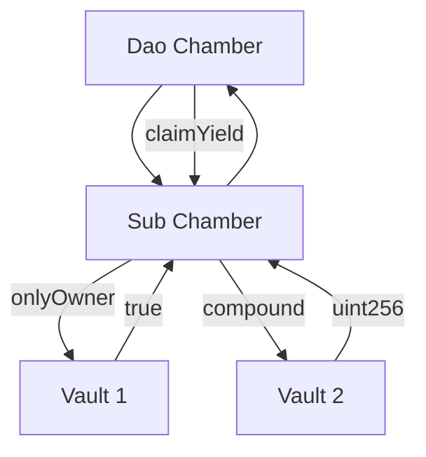
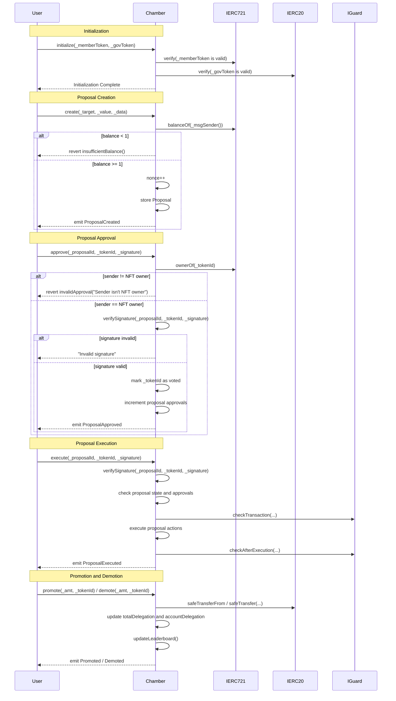
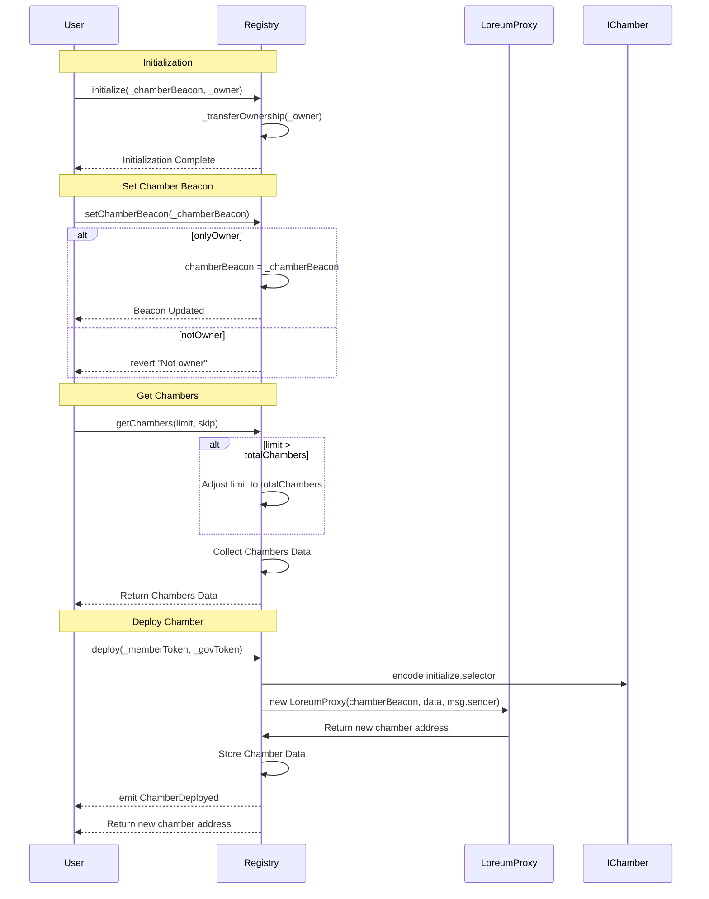

# Chamber Multisig


[](https://docs.loreum.org/blog)
[](https://github.com/loreum-org/chamber/LICENSE)

The Chamber is a multisig wallet that enables liquid democracy for Treasury and Protocol Management by the token community. Due to their composability, Chambers are a protocol governance standard that enables Access Control Roles to be controlled by token holders through representative leaders, rather than a core group of static founders. This enables decentralized ownership of DeFi protocols.
Chambers provide the functionality of a multisig wallet where signers are determined by delegation of ERC20 governance tokens.

The contract inherits upon instantiation existing ERC20 governance and ERC721 membership tokens. Delegations are made to ERC721 tokens which creates a leaderboard within the Chamber contract. The leaders are responsible for signing transactions and being the governors of the multisig. Each leader has a single vote that is not correlated to wallet balance, but rather by delegation of ERC20 governance tokens by the community against their NFT TokenId.

## Use Cases

1. **Treasury Multisig**

The primary use cases for a chmaber contract is to be a treasury multisig wallet that owns the various roles and assets of a DAO or DeFi protocol. It's intended to be a drop-in replacement for the "Gnosis" Safe Multisig wallet.

2. **DeFi Composability**

Chambers are composable by inheriting any exisitng governance ERC20 token accross a number of Chambers and Sub Chambers. This horizontal and veritical composibility creates utility and intrinsic scarcity of governance tokens.



3. **DAO Governance**

Instantiating a Chamber with the same ERC20 and ERC721 tokens as used in common with the token-econmic model creates a shared value system. Voting power to control assets depends on token delegation which can migrate, but not inflate or dilute voting power across the various Chambers. The scarcity of total supply extends to limit the authority of token balances.


Each Chamber is created with a designated number of leaders and a quorum. Each leader has a single vote and is represented by an NFT tokenId. If a member of the community removes their delegatation to a tokenId, that leader may be removed from the leaderboard and lose their ability to approve transaction proposals. Leaders have multisig signing authority only so long as their delegation places them at the top of the leaderboard. This creates a representative board of decision makers based on revocable authority by delegation.

### Setup

```
git submodule update --init --recursive
```

### Foundry

```
forge build
forge test

# You know what to do
```

## Deployments

### Sepolia

| Contract                    | Address                                                                                   |
|-----------------------------|-------------------------------------------------------------------------------------------|
| Chamber Implementation      | [`0xF93daf74E470848614E640A696EBFb686fFf356D`](https://sepolia.etherscan.io/address/0xF93daf74E470848614E640A696EBFb686fFf356D) |
| Chamber LoreumBeacon        | [`0x2B4E656E37654D659827E4d595124Ce5694a3535`](https://sepolia.etherscan.io/address/0x2B4E656E37654D659827E4d595124Ce5694a3535) |
| Registry Implementation     | [`0x19E6Ecd8Dc7bec16071B385f1918F6440Ba921A0`](https://sepolia.etherscan.io/address/0x19E6Ecd8Dc7bec16071B385f1918F6440Ba921A0) |
| Registry Beacon             | [`0x478ca7651511b862Acf49f2bcbD46A718985b0e6`](https://sepolia.etherscan.io/address/0x478ca7651511b862Acf49f2bcbD46A718985b0e6) |
| Registry Proxy              | [`0xB3a7323b70A29604686a2da4d053cF429BAC4E7E`](https://sepolia.etherscan.io/address/0xB3a7323b70A29604686a2da4d053cF429BAC4E7E) |
| BLKH NFT                    | [`0xe02A8f23c19280dd828Eb5CA5EC89d64345f06d8`](https://sepolia.etherscan.io/address/0xe02A8f23c19280dd828Eb5CA5EC89d64345f06d8) |
| LORE Token                  | [`0xd6a10328D8cd00747031daef6a12f811F4eA0A37`](https://sepolia.etherscan.io/address/0xd6a10328D8cd00747031daef6a12f811F4eA0A37) |


## Chamber Contract Overview

The Chamber contract, part of the Loreum Chamber v1, is a Multsignature protocol management solution. It is designed to facilitate decentralized governance and liquid democracy within the Ethereum blockchain ecosystem. By leveraging ERC721 (NFTs) for membership and ERC20 tokens for governance (staking), the Chamber contract introduces a unique approach to protocol and treasury management.

### Key Features

**Membership and Governance**: Utilizes ERC721 tokens to represent membership and ERC20 tokens for governance staking, enabling a token-based voting and delegation system.

**Leaderboard Mechanism**: Implements a leaderboard to track the top members based on the total amount of governance tokens delegated to their NFTs. This system is crucial for determining the voting power and influence of each member within the Chamber.

**Proposal Management**: Offers a comprehensive system for creating, approving, and executing proposals. This includes tracking proposal states, counting approvals, and ensuring that only eligible members can vote on proposals.

**Signature Verification**: Incorporates ECDSA signature verification to authenticate actions such as proposal approvals, ensuring that only the rightful NFT owners can participate in the voting process.

**Delegation Tracking**: Maintains detailed records of governance token delegation, both on a per-NFT basis 1 and per-user basis 2, facilitating transparent and fair governance.

**Dynamic Leaderboard Updates**: Features mechanisms to promote or demote members on the leaderboard based on changes in their delegated token balance, ensuring the leaderboard remains current and reflective of the community's consensus.

### Functions

`initialize(address _memberToken, address _govToken)`: Sets up the contract with the specified ERC721 and ERC20 tokens for membership and governance, respectively.

`create(address[] memory _target, uint256[] memory _value, bytes[] memory _data)`: Allows members to create new proposals for community consideration.

`approve(uint256 _proposalId, uint256 _tokenId, bytes memory _signature)`: Enables NFT owners to approve proposals, using their signature for authentication.

`promote(uint256 _amt, uint256 _tokenId) and demote(uint256 _amt, uint256 _tokenId)`: Adjusts a member's position on the leaderboard by increasing or decreasing their delegated token balance.

`execute(uint256 _proposalId, uint256 _tokenId, bytes memory _signature)`: Executes a proposal that has met the required approval threshold, performing the proposed actions.

### Events

`ProposalCreated, ProposalApproved, ProposalExecuted, Promoted, Demoted`: Emit important information about governance activities, providing transparency and traceability of actions within the Chamber.

The Chamber contract is a cornerstone for decentralized governance, enabling a community-driven approach to decision-making and asset management. Its integration of NFTs for membership and ERC20 tokens for governance stakes positions it as a versatile tool for DAOs and other decentralized organizations seeking to implement liquid democracy.



## Registry Contract Overview
The Registry contract serves as a central directory for managing and deploying Chamber contracts within a decentralized platform. Built on Solidity 0.8.24, it leverages the power of smart contracts on the Ethereum blockchain to ensure secure and efficient governance mechanisms. This contract is part of a larger ecosystem aimed at enhancing liquid democracy and governance through tokenized representation.

### Key Features

**Chamber Management:** The Registry contract keeps track of all deployed Chamber contracts, which are specialized multisig wallets designed for decentralized governance. Each Chamber is associated with specific ERC20 governance tokens and ERC721 membership tokens.

**Beacon-Based Deployment**: Utilizes a beacon contract address 1 to standardize the creation of new Chamber contracts. This approach ensures that all Chambers are deployed with consistent logic and can be upgraded collectively through the beacon.

**Ownership and Initialization**: Inherits from OpenZeppelin's Ownable and Initializable contracts, providing a secure ownership model along with a safe initialization pattern. This prevents reinitialization attacks and ensures that only the contract owner can perform critical actions like setting the chamber beacon address.

**Flexible Chamber Retrieval**: Offers a function to retrieve a list of deployed Chambers, with support for pagination through limit and skip parameters. This feature facilitates easy access and management of a potentially large number of Chamber contracts.

**Secure Chamber Deployment**: Allows the deployment of new Chamber contracts by specifying the associated member (ERC721) and governance (ERC20) tokens. The deployment process is secured by ensuring that only the contract owner can initiate it, and by validating the non-zero addresses of the tokens.

### Functions

`initialize(address _chamberBeacon, address _owner)`: Initializes the contract with a beacon address for Chamber contracts and transfers ownership to the specified owner.

`setChamberBeacon(address _chamberBeacon)`: Updates the beacon address used for deploying new Chambers. Restricted to the contract owner.

`getChambers(uint256 limit, uint256 skip)`: Retrieves a list of deployed Chambers, supporting pagination.

`deploy(address _memberToken, address _govToken)`: Deploys a new Chamber contract using the specified member and governance tokens. Returns the address of the newly deployed Chamber.

### Events
`ChamberDeployed(address chamber, uint256 totalChambers, address indexed sender, address memberToken, address govToken)`: Emitted after a successful deployment of a Chamber contract.

The Registry contract is a a factory deployer for Chambers and allows us to index the data for easier retrivals of data for the interface.


