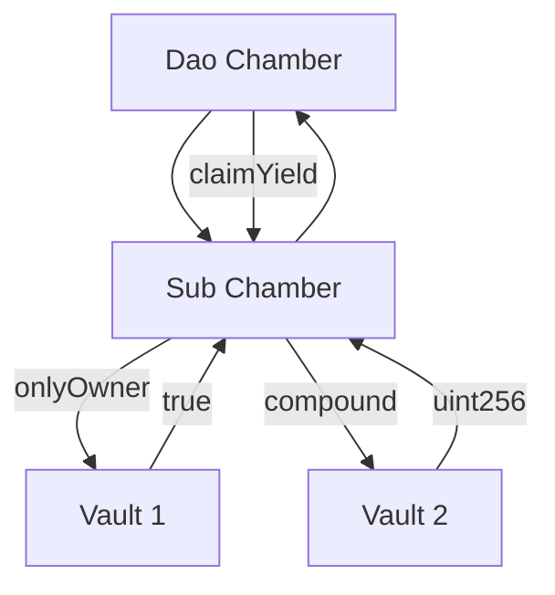
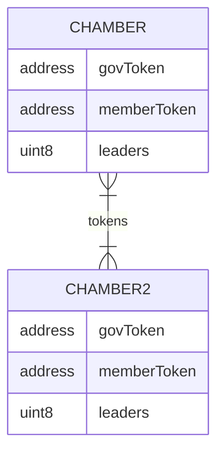

# Loreum Chambers


## Overview
The Chamber contract is a protocol governance standard that provides the functionality of a multisig wallet, however the signers are determined by stake allocation from an ERC20 goverance token.

The contract also uses an ERC721 for membership. Stake allocations are made against the ERC721 token ID which creates a leaderboard within the Chamber contract. The leaders are responsible for signing transactions and being the governors of the multisig.

## Use Cases

1. **Treasury Multisig** 
The primary use-case for a chmaber contract is to be a treasury multisig wallet that governs the assets of a DAO or DeFi protocol.

2. **Defi Composability**
Chambers are composable and designed to inherit the same governance ERC20 token. This creates utility for the token accross an organically composable organization where sub-entities connect and expand horizonally. The scarcity of ERC20 tokens creates intrinsic token demand. Yield distribution and contract governance is controlled by the leaders of the Chamber.



3. **DAO Governance**
Chambers may organically form at shelling points within a community and created by anyone. Instantiating a Chamber with like ERC20 and ERC721 tokens as used in common with the community, the value system is shared among Chambers.



What connects the Chambers is shared value and scarcity of tokens that where used for instantiation parameters to create the contract. If the same `govToken` and `memberToken` are used, the community of tokeneconomic value is shared accross each like Chamber.

Each Chamber is created with a designated quorom of leaders.
### Setup

Copy `.example.env` to `.env`

```
cp .example.env .env
```

`yarn` to install npm packages

```
yarn install
```

`yarn setup` to clone libs.

```
yarn setup
# Or
git submodule update --init --recursive
```

### Foundry

```
forge build
forge test --verbosity -vvv
```

### Hardhat

You'll need to open two terminals.

_Terminal 1_

```
yarn chain
```

_Terminal 2_

```
yarn compile
yarn deploy:local
```
