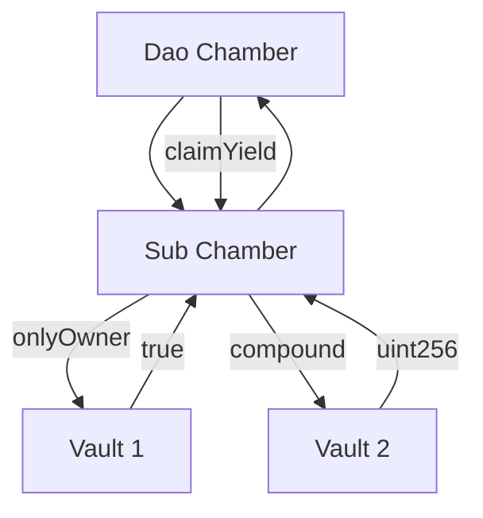
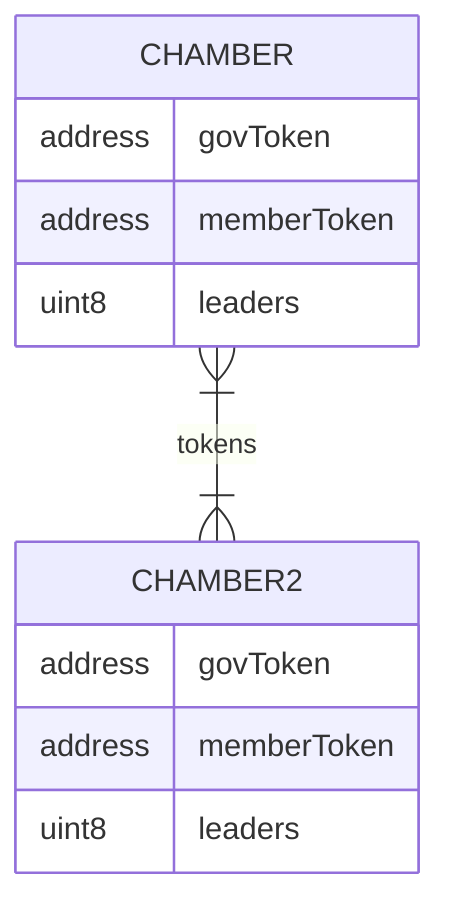

# Chamber Multisig


[](https://docs.loreum.org/blog)
[](https://github.com/loreum-org/chamber/LICENSE)

The Chamber is a multisig wallet that enables liquid democracy for Treasury and Protocol Management by the token community. Due to their composability, Chambers are a protocol governance standard that enable Roles to be controlled by token holders through representative leaders, rather than a core group of static founders. This enables decentralized ownership of DeFi protocols.
Chambers provide the functionality of a multisig wallet where signers are determined by delegation of ERC20 governance tokens.

The contract inherits upon instantiation existing ERC20 governance and ERC721 membership tokens. Delegations are made to ERC721 tokens which creates a leaderboard within the Chamber contract. The leaders are responsible for signing transactions and being the governors of the multisig. Each leader has a single vote that is not correlated to wallet balance, but rather by delegation of ERC20 governance tokens by the community against their NFT TokenId.

## Use Cases

1. **Treasury Multisig**

The primary use-case for a chmaber contract is to be a treasury multisig wallet that owns the various roles and assets of a DAO or DeFi protocol. It's intended to be a drop-in replacement for the "Gnosis" Safe Multisig wallet.

2. **Defi Composability**

Chambers are composable by inheriting any exisitng governance ERC20 token accross a number of Chambers and Sub Chambers. This horizontal and veritical composibility creates utility and intrinsic scarcity of governance tokens.



3. **DAO Governance**

Instantiating a Chamber with the same ERC20 and ERC721 tokens as used in common with the tokeneconmic model creates a shared value system. Voting power to control assets depends up control of token delegataion which can migrate, but not inflate or dilute voting power across the various Chambers. The scarcity of total supply extends to limit the authority of token balances.



Each Chamber is created with a designated number of leaders and a quorum. Each leader has a single vote and is represented by an NFT tokenId. If a member of the community removes their delegatation to a tokenId, that leader may fall-off the leader board and lose their ability to approve transaction proposals. Leaders have multisig signing authority only so long as their delegation places them at the top of the leaderboard. This creates a representative board of decision makers based on revocable authority by delegation.

### Setup

```
git submodule update --init --recursive
```

### Foundry

```
forge build
forge test

# You know what to do
```

## Deployments

### Sepolia

| Contract                    | Address                                      |
|-----------------------------|----------------------------------------------|
| Chamber Implementation      | `0x4fD935F3f68b449cD352402894b5C2beBAF32967` |
| Chamber MultiBeacon         | `0xC7147fCC948145fE22c0daAc515fc84Dcd219976` |
| Registry Implementation     | `0x194528DbC0b3f0c4Ba061e48Bf7179eC8Aba7902` |
| Registry Beacon             | `0x9B9B4b89EA624473f951728982Bf9C47d88b94d8` |
| Registry Proxy              | `0x38ADc3e717Ec759Ed8765F61B2A11dfb561286Ef` |
