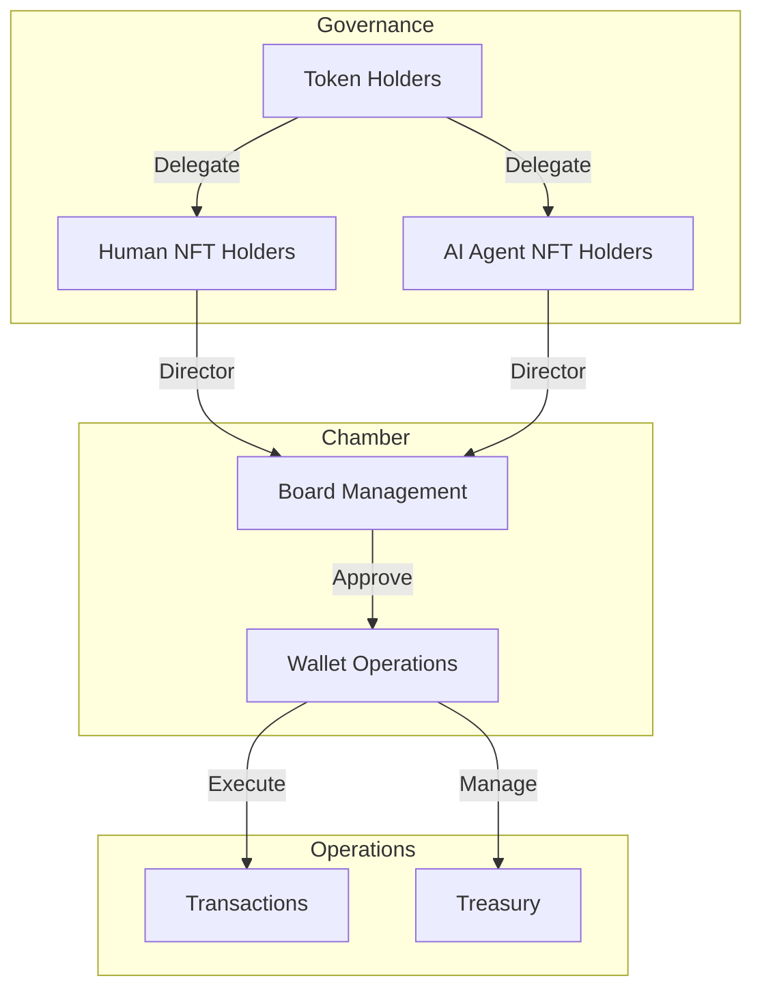

# Loreum Chamber

Loreum is enterprise treasury infrastructure for organizations. Chambers function as corporate entities with an elected board of directors who oversee fiduciary operations and approve transactions through multi-signature governance.

## Overview

The Chamber represents a novel smart account architecture that fundamentally reimagines organizational governance through three integrated components:
- Board management
- Wallet operations
- Delegation mechanics

### Key Features

- Market-driven governance through token delegation
- Hybrid human-AI decision making
- Multi-signature security
- Flexible extensibility through SubDAOs

## Architecture

### Board System
- Maintains an ordered ranking of leaders based on delegated voting power
- Automatically reorders positions when delegation amounts change
- Tracks director status for the top N positions

### Wallet System
- Multi-signature transaction management
- Quorum-based approval system (token-weighted: confirmations are per membership NFT, not per address)
- One address holding `quorum` top-seat membership NFTs is a single-actor treasury
- Batch transaction support
- Revocable transaction confirmations

### Delegation System
- Market-driven leadership selection
- Fluid reallocation of voting power
- Double-entry bookkeeping for delegations
- Immediate withdrawal capabilities



```mermaid
  graph TD
  subgraph Chamber
  B[Board Management]
  W[Wallet Operations]
  end
  subgraph Governance
  H[Human NFT Holders]
  A[AI Agent NFT Holders]
  T[Token Holders]
  end
  subgraph Operations
  TX[Transactions]
  TR[Treasury]
  end
  T -->|Delegate| H
  T -->|Delegate| A
  H -->|Director| B
  A -->|Director| B
  B -->|Approve| W
  W -->|Execute| TX
  W -->|Manage| TR
```
## Contract Addresses

### Sepolia Testnet (26 Aug 2026)
- Factory: `0x43aA92c8A26392f21F63cdA88B6BaB5031C40550`
- Chamber implementation: `0xd441f1FDad2d3a447d2621DE4DE8b5738e02d39c`
- BoardLib: `0xC3E0Fe4e89e01ca69e384bd61DA78a5a6379762D`
- WalletLib: `0x0320284b176657bb5048CF586DEef530F4B2499a`
- Team Multisig: `0x5d45a213b2b6259f0b3c116a8907b56ab5e22095`
- Demo ERC-20 (`MockERC20`, Deploy form default): `0x486D69BcAF1E07e4F90edDA9fA7e09De50CD01a2`
- Demo membership ERC-721 (`MockERC721`, Deploy form default): `0x03CBb0Bb72aeB043b0dc8B299FaCFe77f9159688`

These demo tokens are recorded in `contracts/deployments/sepolia.txt` and are what `getContractAddresses(11155111)` returns with no env. They have permissionless `mint` so a connected wallet can hold the membership NFT and demo ERC-20 via **Mint Test NFT** / **Mint Test ERC20** in the app header. Redeploy with `make deploy-sepolia-mocks` in `contracts/` and update `sepolia.txt` — do not invent addresses.

## Ethereum
- Governance Token: `0x7756d245527f5f8925a537be509bf54feb2fdc99`
- Membership Token: `0xB99DEdbDe082B8Be86f06449f2fC7b9FED044E15`

## Documentation

For detailed documentation, visit [docs.loreum.org](https://docs.loreum.org)

## Community

- Discord: [Join our Discord](https://discord.gg/Pb3d5hRV)
- Twitter: [@loreumdao](https://twitter.com/loreumdao)
- GitHub: [loreum-org](https://github.com/loreum-org)

## Operator SDK / CLI

The React app is the human operator surface. Agents cannot click `TransactionQueue`. Use [`packages/operator`](./packages/operator) — same Chamber ABI as `contracts/generated-abis.ts`, no second contract API. See [#146](https://github.com/loreum-org/chamber/issues/146).

```bash
# Anvil end-to-end (Foundry: anvil + forge)
cd packages/operator
npm install
npm run example:anvil
```

That run reads board + quorum, delegates, then `submitTransaction` / `confirm` / `execute`. Reverts for seating delay, pause, expired nonce, and not-a-director print the same copy as the app (`Your seat is not mature yet`, `This chamber is paused`, `This transaction has expired`, `You are not a director`).

Library / CLI details: [`packages/operator/README.md`](./packages/operator/README.md).

## License

MIT License


== Logs ==
  Registry deployed at: 0x9fE46736679d2D9a65F0992F2272dE9f3c7fa6e0
  MockERC20 deployed at: 0xCf7Ed3AccA5a467e9e704C703E8D87F634fB0Fc9
    Name: Mock Token
    Symbol: MOCK
    Initial Supply: 1000000 tokens
  MockERC721 deployed at: 0xDc64a140Aa3E981100a9becA4E685f962f0cF6C9
    Name: Mock NFT
    Symbol: MNFT


## Testing

`make loreum-fund-wallet WALLET=0xf39Fd6e51aad88F6F4ce6aB8827279cffFb92266`

### Mainnet fork rehearsal (M1 LORE Ownable)

Dry-run Factory deploy + Chamber create + Safe `transferOwnership` of LORE on an Ethereum **fork** (no live broadcast). Requires `MAINNET_RPC_URL` or `ETH_RPC_URL`. Without an RPC, `forge test` skips the fork case. Commands and success checks: [`contracts/docs/mainnet-lore-handoff-rehearsal.md`](./contracts/docs/mainnet-lore-handoff-rehearsal.md).

