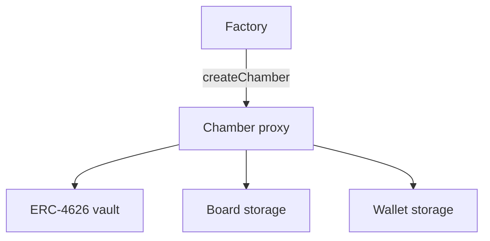

# How the contracts fit together

> **Audience:** newcomers can skip this page. It is for builders who want a map of **what runs onchain** after reading **[What is a Chamber?](../introduction/overview.md)**.

A Chamber is **one proxy address** that combines:

| Piece | File (concept) | Job |
|-------|----------------|-----|
| **Vault** | ERC‑4626 in `Chamber` | Share accounting |
| **Board** | `Board` mixin | Delegation leaderboard + seats |
| **Wallet** | `Wallet` mixin | Proposal queue |
| **Factory** | `Factory` | Deploy new Chamber proxies (intended create path) |

## Chamber proxy

- Initialized with **underlying ERC‑20**, **membership ERC‑721**, **seat count**, and share **name/symbol**.  
- **Upgradeable** — logic changes go through **`upgradeImplementation`**, normally as a queued transaction.  
- **`ProxyAdmin` ownership** is transferred to the Chamber itself after Factory deploy (so upgrades are also director-gated).

## Factory (intended create path)

- Thin, **non-proxy** deployer. Stores the **implementation** used for new Chambers.  
- **`createChamber`** deploys a new transparent proxy, initializes it, transfers **ProxyAdmin** to the chamber, and emits **`ChamberCreated`**.  
- Does **not** store a world directory, asset index, or parent/child tables. Discover chambers via logs or an indexer.  
- **`setImplementation`** is owner-gated and applies to **future** deploys only (does not auto-upgrade existing Chambers).  
- There is no **`createAgent()`** — that function does not exist.

## Registry (leftover)

- Historical factory + enumerable index. **`createChamber`** still deploys a proxy the same way and may record **parent/child** if the vault asset is another registered Chamber.  
- That nested wiring is leftover — not the product default and not a shipped Sub-Chamber surface.  
- **`ADMIN_ROLE`** can update the implementation pointer for **future** leftover creates.  
- **`getAllChambers` / `getParentChamber` / `getChildChambers`** remain for already-indexed addresses only.

## Offchain app

The web app (`app/`) prefers Factory when configured. It reads Chamber state and sends transactions users sign in their wallet — deposit, delegate, queue actions. Registry create is used only if Factory is unset.

## Factory vs lab deploy scripts

Production-shaped flows use **`Factory.createChamber`**. Standalone Chamber deploy scripts in `contracts/script/` may leave **ProxyAdmin** with a different owner — fine for local experiments; **not** the product default. Prefer Factory over leftover Registry for new deploys.

## Read next

- **[Governance](./governance.md)** — behavior in plain language  
- **[Director authorization](./director-authorization.md)** — owner and session keys  
- **[Design notes](./design-notes.md)** — storage layout and limits (`MAX_NODES` = 50)  
- **[Deployment](../guides/deployment.md)** — Foundry commands  
- **[API reference](../reference/api-reference.md)**  
