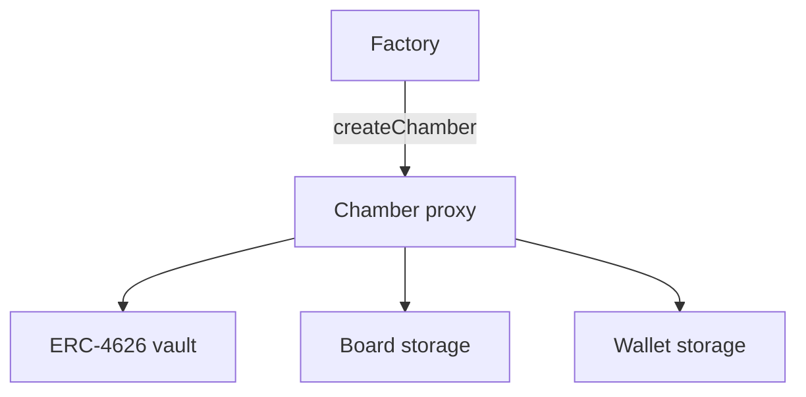

# How the contracts fit together

> **Audience:** newcomers can skip this page. It is for builders who want a map of **what runs onchain** after reading **[What is a Chamber?](../introduction/overview.md)**.

A Chamber is **one proxy address** that combines:

| Piece | File (concept) | Job |
|-------|----------------|-----|
| **Vault** | ERC‑4626 in `Chamber` | Share accounting |
| **Board** | `Board` mixin | Delegation leaderboard + seats |
| **Wallet** | `Wallet` mixin | Proposal queue |
| **Factory** | `Factory` | Deploy new Chamber proxies |

Create deploys that standalone object. Nested Sub-Chambers and Registry parent↔child wiring are a **contemplated pattern**, not the live architecture.

## Chamber proxy

- Initialized with **underlying ERC‑20**, **membership ERC‑721**, **seat count**, and share **name/symbol**.
- **Upgradeable** — logic changes go through **`upgradeImplementation`**, normally as a queued transaction.
- **`ProxyAdmin` ownership** is transferred to the Chamber itself after Factory deploy (so upgrades are also director-gated).

## Factory

- Stores the **implementation** used for new Chambers.
- **`createChamber`** deploys a new transparent proxy, initializes it, and transfers **ProxyAdmin** to the Chamber.
- Does **not** store an enumerable world list, asset index, or parent/child tables. Discover chambers via **`ChamberCreated`** logs (indexer or `getLogs`).
- **Owner** can update the implementation pointer for **future** deploys (does not auto-upgrade existing Chambers).
- There is no **`createAgent()`**.

## Registry (leftover)

- Historical factory + enumerable index. Create does **not** use it when Factory is configured.
- May still record **parent/child** for older Registry-created chambers. That is **not** the live architecture.
- **`getAllChambers()`** and parent↔child getters live here. They are leftover, not what Create writes.

## Offchain app

The web app (`app/`) reads Factory `ChamberCreated` logs (and leftover Registry if configured) and Chamber state, then sends transactions users sign in their wallet — deposit, delegate, queue actions.

## Factory vs lab deploy scripts

Production-shaped flows use **`Factory.createChamber`**. Standalone Chamber deploy scripts in `contracts/script/` may leave **ProxyAdmin** with a different owner — fine for local experiments; **not** the product default.

## Read next

- **[Governance](./governance.md)** — behavior in plain language
- **[Design notes](./design-notes.md)** — storage layout and limits
- **[Deployment](../guides/deployment.md)** — Foundry commands
- **[API reference](../reference/api-reference.md)**
